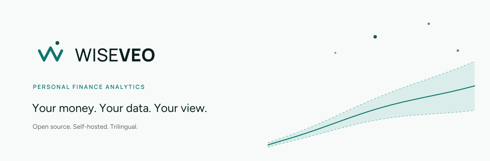
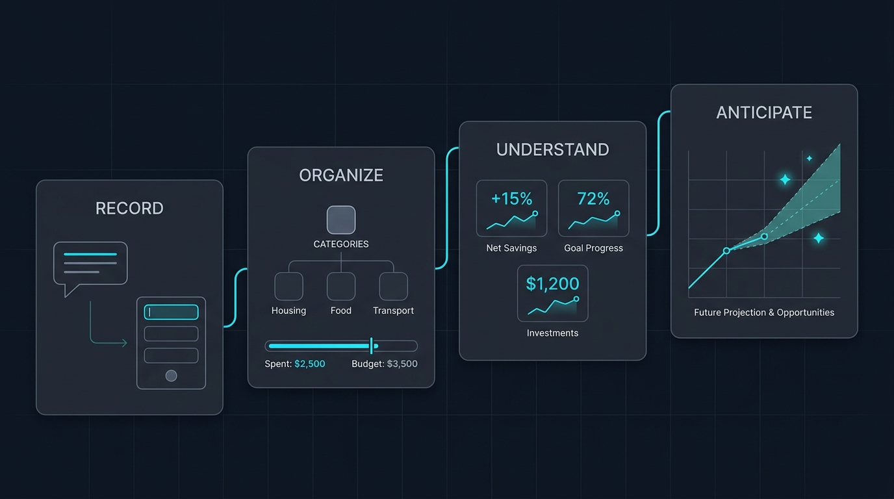

<div align="center">

<picture>
  <source media="(prefers-color-scheme: dark)" srcset=".github/assets/banner-dark.svg">
  
</picture>

**Personal finance analytics that you can actually verify.**

See where your money is going before it goes, and check every number behind it.

[Try the live demo](https://demo.wiseveo.com) · [Quick start](#quick-start) · [Feature tour](#what-you-get) · [Self-hosting](#deployment)

[](LICENSE)


</div>

---

## What Wiseveo is

Wiseveo is a self-hosted personal finance cockpit. It is closer to a financial analyst than to an expense tracker: it keeps a real chart of accounts, produces an income statement for your household, and runs a dozen statistical indicators that tell you how long your money lasts and where it quietly leaks.

The competition it was built against is not another budgeting app. It is the spreadsheet, the bank statement, and guesswork.

Three things make it different from most tools in this category:

1. **The math is transparent.** Every indicator shows its own formula in a "how this is calculated" tooltip. Nothing is an opaque "AI insight."
2. **The data is yours.** It runs entirely on your own PostgreSQL database, including receipt attachments. A single database backup carries your whole financial history.
3. **It is honest about what it does not know.** When there is not enough history, a card says so instead of printing a misleading number.

---

## How it works

<div align="center">
  
</div>

---

## What you get

### Ten areas, one cockpit

| Area | What it does |
| --- | --- |
| **Dashboard** | Balance, income, expense and savings cards with month-over-month deltas, an interactive cash flow chart, and spending by group |
| **Insights** | Twelve statistical indicators grouped into Today, Patterns, and Projections |
| **Transactions** | Income, expenses, and transfers with installments, attachments, comments, bulk actions, and one-click payment |
| **Recurring** | Templates for fixed bills and subscriptions that post real transactions in one click |
| **Budget** | Budgets that calculate their own limits from your spending history |
| **Analysis** | A personal income statement (DRE) for any period, by account group |
| **Forecasting** | Category-by-category projection to year end with three selectable models |
| **Banks** | Multiple accounts with balance today and projected balance at month end |
| **Calendar** | Each day as a mini statement with opening and closing balance, syncable to Google Calendar |
| **Settings** | Currency format, language, appearance, chart of accounts, and user administration |

### The intelligence layer

The Insights page is the heart of the product. Twelve indicators, all computed by deterministic services with documented thresholds:

**Today**
- **Safe to spend:** today's balance minus everything committed in the next 30 days, expressed as a daily allowance.
- **Emergency reserve:** months of coverage, with a target calibrated to *your* income volatility. Stable salaries need about three months, irregular income can need nine.
- **Budget pacing:** budget consumed versus month elapsed, including the projected day your budget breaks.

**Patterns**
- **Savings rate** against a rolling twelve-month average.
- **Burn rate:** the last three months against your own twelve-month baseline, which catches slow erosion a single month hides.
- **Spending anomaly:** each expense group compared to its twelve-month median using a modified z-score with MAD (Iglewicz and Hoaglin, threshold 3.5), which resists the old spikes that would poison a simple average.
- **Fixed commitment** and **recurring load** as a share of income.
- **Cost of being late:** overdue bills priced in real currency using the Brazilian consumer code standard (2% penalty plus 1% monthly interest, pro rata).

**Projections**
- **Days until negative balance:** a day-by-day simulation per account, using diffuse daily spending from the last 90 days excluding the top decile.
- **Projected month end** with a p25 to p75 confidence band drawn from your last twelve months.
- **Cash runway:** balance divided by average net burn, which answers how long your money lasts on the trajectory you are actually on.

Forecasting offers three models you choose between: moving average, linear regression, and exponential smoothing. Both cash and accrual regimes are supported, with vertical and horizontal analysis.

### Beyond the browser

- **Telegram bot.** Ask questions in plain language in any of the three supported languages. It answers with rendered visual cards instead of plain text, and remembers conversation context for follow-ups.
- **Google Calendar.** Your transactions become day events with opening and closing balances. The sync only ever removes events it created.
- **Instant demo.** Visitors get an isolated account seeded with 300 realistic transactions, deleted automatically after 24 hours. No signup.

---

## Quick start

**Requirements:** Node.js 20 or newer, and either Docker or a PostgreSQL connection string.

```bash
git clone https://github.com/afild/wiseveo.git
cd wiseveo
npm install
```

Start a local database (skip if you already have PostgreSQL):

```bash
docker compose up -d
```

Copy the environment template and set the two required values:

```bash
cp .env.example .env
```

Only `DATABASE_URL` and `AUTH_SECRET` are required. Everything else is optional and degrades gracefully when absent.

Run it:

```bash
npm run dev
```

Open `http://localhost:3000`. A setup wizard walks you through the database connection, the admin account, optional integrations, and your initial chart of accounts, then applies migrations and restarts itself. You do not need to edit configuration files by hand.

To seed sample data instead:

```bash
npm run db:setup
```

---

## Optional integrations

Each module activates only when its environment variables are present.

**Google sign-in and Calendar**

```env
GOOGLE_CLIENT_ID="your-client-id"
GOOGLE_CLIENT_SECRET="your-client-secret"
```

**Telegram assistant**

```env
TELEGRAM_BOT_TOKEN="token-from-botfather"
TELEGRAM_BOT_USERNAME="your-bot-username"
TELEGRAM_WEBHOOK_SECRET="a-random-string"
OPENAI_API_KEY="your-openai-key"
```

Register the webhook once the app is running:

```bash
curl "http://localhost:3000/api/telegram/register-webhook?secret=YOUR_TELEGRAM_WEBHOOK_SECRET"
```

---

## Internationalization

Wiseveo is trilingual by construction, not by translation afterthought. Portuguese (pt-BR), English (en-US), and Latin American Spanish (es-419) each carry 1,822 keys across 27 namespaces, covering the interface, tables, charts, validation messages, API errors, and the Telegram bot.

Two build gates enforce it: a dictionary parity check and an AST scan for hardcoded strings. Both run inside `npm run build` and block deployment when a translation is missing.

```bash
npm run check:i18n        # dictionary parity across the three locales
npm run check:i18n:code   # static scan for hardcoded UI strings
npm run i18n:translate    # fill en-US and es-419 from pt-BR, then review the diff
```

Currency formatting is deliberately decoupled from interface language. You can run the app in Spanish while reading values in Brazilian reais.

---

## Deployment

**Self-hosted.** Docker Compose ships a PostgreSQL 16 service. Three environment variables get you running, and your data never leaves your machine.

**Vercel or similar.** Provision a managed PostgreSQL instance (Neon, Supabase, Railway), point `DATABASE_URL` at it, and set `AUTH_SECRET` and `NEXT_PUBLIC_APP_URL`. The build script generates the Prisma client automatically.

---

## Tech stack

Next.js 16 (App Router) and React 19, Prisma 7 against PostgreSQL 16, Tailwind CSS v4 with tokens defined in OKLCH, shadcn/ui on Radix primitives, Lucide icons, Recharts for charts, next-intl for localization, and the Vercel AI SDK for the Telegram assistant.

The data model spans 15 Prisma models and 13 versioned migrations, served by 51 API routes. Every model cascades on user deletion, so removing an account really removes everything.

---

## Design system

Wiseveo has a full brand and UI design system: a bi-modal color family (teal in light mode, graphite with cyan accents in dark mode), Manrope and Figtree typography, financial microtypography rules such as tabular figures and a real minus sign, and 27 documented components audited to WCAG 2.2 AA.

Design tokens are published in two synchronized layers:

- `wiseveo.tokens.json` in W3C Design Tokens format, from primitives through semantic roles to data visualization.
- `wiseveo-theme.css` with `:root`, `.dark`, and the `@theme inline` mapping for Tailwind v4.

The brand book and component specifications live outside this repository for now.

---

## Roadmap

Open Banking connections, voice capture for transactions, an in-app AI assistant, a drag and drop dashboard, an investments module, personal inflation compared to the official index, and additional languages.

---

## Why it is free

Wiseveo costs little because the model is honest, not because the product is worth less. It is open source, it has no advertising, and it never sells data. Your database is yours, which also means nobody can shut this down and take your history with them.

---

## License

MIT. See [LICENSE](LICENSE).

<div align="center">
<br>

<br><br>
<sub>Built by AFILD</sub>
</div>
